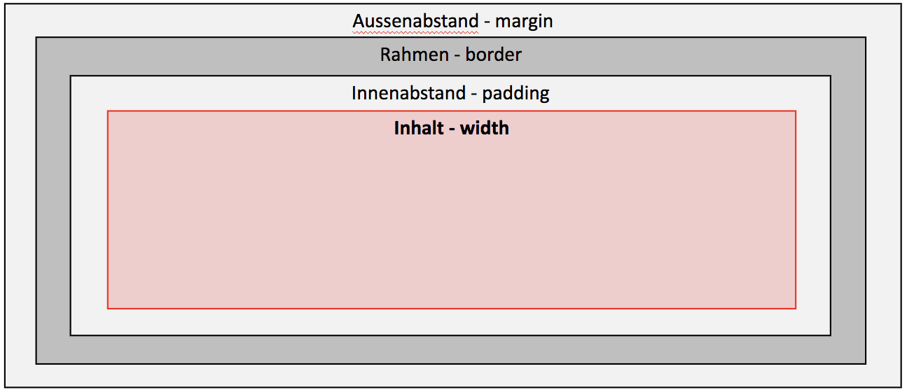
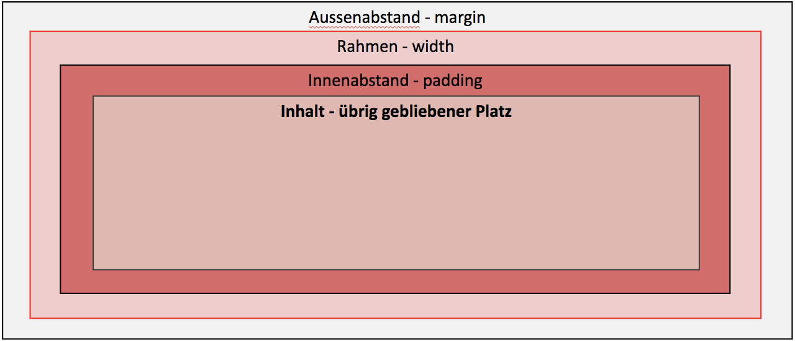

CSS Basics
=============
# TODO

 - [ ] Selektoren Spezifizität
 - [ ] Chrome Dev Tools
 - [ ] Absolute and relative positioning

# Unterschied HTML und CSS
HTML Dient der Struktuierung des Inhaltes, während CSS rein für die Gestaltung des Inhalts verwendet wird.

# CSS Dateien
CSS Dateien können Entweder "inline", also innerhalb des HTMLs eingebettet werden, oder als externe Datei im HTML referenziert werden. Inline Styles sollten grundsätzlich vermieden werden, da sie auf jeder HTML Seite eingefügt werden müssen. Dadurch muss sehr viel Code doppelt gepflegt werden.

## Struktur einer CSS Datei

### Externe CSS Datei

Dazu müsst ihr zum einen eine neue Datei anlegen, welche mit `.css` endet.

    body {
        background-color: #d0e4fe;
    }
    h1 {
        color: orange;
        text-align: center;
    }
    p {
        font-family: "Times New Roman";
        font-size: 20px;
    }

Im HTML müsst ihr euere CSS Datei dann noch innerhalb des `<head>` Tags referenzieren.

    <head>
      <link rel="stylesheet" type="text/css" href="style.css">
    </head>

### Inline CSS

Bei Inline CSS kannst du zwischen den `
    </head>
    <body>
      <h1>Titel</h1>
      
This is a paragraph.

    </body>
    </html>

# Selektoren

## Grundaufbau

    selektor {
      Eigenschaft: Wert;
    }

## Klassen Selektoren

**HTML**

    
 … 

**CSS**

    p.klassenname { color: black; }

## ID Selektoren
**HTML**

    
 … 

**CSS**

    #identifikation { color: black; }

## Kontextsensitive Selektoren

## Pseudo-Selektoren

# Eigenschaften

## Farben

Einige beispiele für Farb Eigenschaften eines Elementes sind:

    color: blue;
    background-color: red;
    border-color: green;

## Font-Size

# Spezifizität

Das Prinzip, wie genäuer die Regel ist, desto stärker ist sie, nennt sich spezifizität.

Selektor | Gewicht | Priorität
---------|----------|---------
 ID | 1,0,0 (100) | höchste Priorität
 Klasse | 0,1,0 (10) | mittlere Priorität
 Element | 0,0,1 (1) | niedrigste Priorität

Die Gewichte werden Pro Selektor addiert, wie z.B. im Beispiel am unteren Paragraphen

    
Das ist ein <strong>Test</strong>

Selektor | Gewicht
---------|----------
 `strong { … }` | 0,0,1
 `p strong  { … }` | 0,0,2
 `p.beispiel strong  { … }` | 0,1,2

 Wenn du nicht sicher bist, welche Spezifität dein Selektor hat, kannst du ihn auf auf der Webseite https://specificity.keegan.st/ berechnen.

 # Block & Inline-Elemente

Blockelemente erzwingen einen Umbruch und sind standardmässig immer 100% breit. Inline Elemente erzeugen keine neue Zeile und befinden sich im Textfluss.

**Block Elemente sind unter anderem:**
* p
* div
* ol, ul
* h1, h2, h3, h4, h5, h6
* form
* table
* etc

Mehr Block Elemente auf [MDN](https://developer.mozilla.org/de/docs/Web/HTML/Block-level_elemente)

**Beispiele für Inline Elemente sind:**

* b, i
* strong
* a
* br
* img
* span
* button, input, label, select, textarea

Mehr Inline Elemente auf [MDN](https://developer.mozilla.org/de/docs/Web/HTML/Inline_elemente)

# Container-Elemente

Container Elemente haben an sich keinen Style und sind dadurch "unsichtbar". Standardmässig haben sie allerdings einen weissen Hintergrund.

## Box-Model

Mehr zum Box Model auf [MDN](https://developer.mozilla.org/de/docs/Web/CSS/CSS_Boxmodell)

### Margin

Margin definiert die Aussenabstände eines Elements

### Border

Die Border Eigenschaft legt den Rahmen eines Elementes fest. Beim Rahmen kann die Dicke, die Farbe sowie die Linienvariante bestimmt werden. Der Border kann pro Seite einzeln bestimmt werden.

    border: 1px;
    border: 2px dotted;
    border: medium dashed green;

Mit `border` werden alle Seiten des Elementes angesprochen. Möchtest du nur eine Seite des Elementes mit einem Border versehen, so kannst du dies folgendermassen machen:

    border-bottom: 1px red;
    border-top: 2px blue;
    border-left: 3px green;
    border-right: 4px orange;

Zum Border gibts noch weitere Eingenschaften. Diese findest du auf [MDN](https://developer.mozilla.org/de/docs/Web/CSS/border)

### Padding

Die Padding Eigenschaft definiert die Innenabstände eines Elementes. Mit Innenabstand ist der Bereich zwischen dem Inhalt und dem Rahmen gemeint.

### Width

Die width CSS Eigenschaft definiert die Breite des Inhaltsbereiches eines Elementes fest. Der Inhaltsbereich ist *innerhalb* des Innenabstands.

### Border-Box Trick

Um umzustellen, was `width` bedeutet. Gibt es in CSS die Eigenschaft `box-sizing`. Setzt ihr dieses auf `border-box`, wird die ganze Breite des Elementes mit `width` definiert. Bei der Standard Einstellung `content-box` definiert `width` nur nur die Grösse des Inhalts, ohne Padding und Border.

Box-Sizing-Typ | Berechnung
---------|----------
 content-box (Default) | width = Breite des Inhalts
 border-box | width = Breite des Inhalts + Padding + Border

Um das Box-Model für die ganze Seite auf `border-box` zu setzten, musst du folgendes CSS verwenden.

    html {
      box-sizing: border-box;
    }
    *, *:before, *:after {
      box-sizing: inherit;
    }

## Positionierung

HTML Elemente können mit CSS auf unterschiedliche Arten positioniert werden.

Position | Beschreibung
---------|----------
 relative | Positionierung im Dokumentenfluss
 absolute | Element wird vollkommen aus dem Dokumentenfluss entfernt
 fixed | Element wird absolut positioniert, scrollt aber nicht
 static | Standardwert

### Absolute + Relative Positionierung

Wenn ein Element absolut definiert wird, beziehen sich die Pixel auf die Position des ersten relativen Eltern Elements. Hat das Element kein relatives Eltern Element, so bezieht sich die position auf das `body` Element. D.h. die Position 0,0 befindet sich oben Links am Viewport.

Diese Eigenschaft kann genutzt werden, um z.B. einen Schliessen Button innerhalb eines anderen Elementes zu positionieren.

  **HTML**

    
<!-- ich bin relativ -->
      
X
 <!-- ich bin absolut -->
    

  **CSS**

    .box {
      /* relative damit sich absolute von .close-btn auf dieses Element bezieht */
      position: relative;
      width: 400px;
      height: 400px;
      background-color: yellow;
    }

    .close-btn {
      position: absolute; /* Absolut positionieren */
      top: 10px; /* 10 PX vom oberen Rand von .box */
      right: 10px; /* 10 PX vom rechten Rand von .box */
      border: 1px solid red;
      padding: 5px;
    }

Mehr zu Positioning auf [MDN](https://developer.mozilla.org/de/docs/Web/CSS/position)

## Einheiten