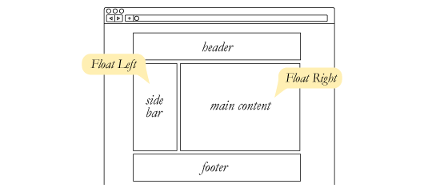

CSS Basics
=============
# TODO

 - [ ] Selektoren Spezifizität
 - [ ] Chrome Dev Tools
 - [ ] Absolute and relative positioning

# Unterschied HTML und CSS
HTML Dient der Struktuierung des Inhaltes, während CSS rein für die Gestaltung des Inhalts verwendet wird.

# CSS Dateien
CSS Dateien können Entweder "inline", also innerhalb des HTMLs eingebettet werden, oder als externe Datei im HTML referenziert werden. Inline Styles sollten grundsätzlich vermieden werden, da sie auf jeder HTML Seite eingefügt werden müssen. Dadurch muss sehr viel Code doppelt gepflegt werden.

## Struktur einer CSS Datei

### Externe CSS Datei

Dazu müsst ihr zum einen eine neue Datei anlegen, welche mit `.css` endet.

    body {
        background-color: #d0e4fe;
    }
    h1 {
        color: orange;
        text-align: center;
    }
    p {
        font-family: "Times New Roman";
        font-size: 20px;
    }

Im HTML müsst ihr euere CSS Datei dann noch innerhalb des `<head>` Tags referenzieren.

    <head>
      <link rel="stylesheet" type="text/css" href="style.css">
    </head>

### Inline CSS

Bei Inline CSS kannst du zwischen den `
    </head>
    <body>
      <h1>Titel</h1>
      
This is a paragraph.

    </body>
    </html>

# Selektoren

## Grundaufbau

    selektor {
      Eigenschaft: Wert;
    }

## Klassen Selektoren

**HTML**

    
 … 

**CSS**

    p.klassenname { color: black; }

## ID Selektoren
**HTML**

    
 … 

**CSS**

    #identifikation { color: black; }

## Kontextsensitive Selektoren

## Pseudo-Selektoren

# Eigenschaften

## Farben

Einige beispiele für Farb Eigenschaften eines Elementes sind:

    color: blue;
    background-color: red;
    border-color: green;

## Font-Size

# Spezifizität

Das Prinzip, wie genäuer die Regel ist, desto stärker ist sie, nennt sich spezifizität.

Selektor | Gewicht | Priorität
---------|----------|---------
 ID | 1,0,0 (100) | höchste Priorität
 Klasse | 0,1,0 (10) | mittlere Priorität
 Element | 0,0,1 (1) | niedrigste Priorität

Die Gewichte werden Pro Selektor addiert, wie z.B. im Beispiel am unteren Paragraphen

    
Das ist ein <strong>Test</strong>

Selektor | Gewicht
---------|----------
 `strong { … }` | 0,0,1
 `p strong  { … }` | 0,0,2
 `p.beispiel strong  { … }` | 0,1,2

 Wenn du nicht sicher bist, welche Spezifität dein Selektor hat, kannst du ihn auf auf der Webseite https://specificity.keegan.st/ berechnen.

 # Block & Inline-Elemente

Blockelemente erzwingen einen Umbruch und sind standardmässig immer 100% breit. Inline Elemente erzeugen keine neue Zeile und befinden sich im Textfluss.

**Block Elemente sind unter anderem:**
* p
* div
* ol, ul
* h1, h2, h3, h4, h5, h6
* form
* table
* etc

Mehr Block Elemente auf [MDN](https://developer.mozilla.org/de/docs/Web/HTML/Block-level_elemente)

**Beispiele für Inline Elemente sind:**

* b, i
* strong
* a
* br
* img
* span
* button, input, label, select, textarea

Mehr Inline Elemente auf [MDN](https://developer.mozilla.org/de/docs/Web/HTML/Inline_elemente)

# Container-Elemente

Container Elemente haben an sich keinen Style und sind dadurch "unsichtbar". Standardmässig haben sie allerdings einen weissen Hintergrund.

## Box-Model

Mehr zum Box Model auf [MDN](https://developer.mozilla.org/de/docs/Web/CSS/CSS_Boxmodell)

### Margin

Margin definiert die Aussenabstände eines Elements

### Border

Die Border Eigenschaft legt den Rahmen eines Elementes fest. Beim Rahmen kann die Dicke, die Farbe sowie die Linienvariante bestimmt werden. Der Border kann pro Seite einzeln bestimmt werden.

    border: 1px;
    border: 2px dotted;
    border: medium dashed green;

Mit `border` werden alle Seiten des Elementes angesprochen. Möchtest du nur eine Seite des Elementes mit einem Border versehen, so kannst du dies folgendermassen machen:

    border-bottom: 1px red;
    border-top: 2px blue;
    border-left: 3px green;
    border-right: 4px orange;

Zum Border gibts noch weitere Eingenschaften. Diese findest du auf [MDN](https://developer.mozilla.org/de/docs/Web/CSS/border)

### Padding

Die Padding Eigenschaft definiert die Innenabstände eines Elementes. Mit Innenabstand ist der Bereich zwischen dem Inhalt und dem Rahmen gemeint.

### Width

Die width CSS Eigenschaft definiert die Breite des Inhaltsbereiches eines Elementes fest. Der Inhaltsbereich ist *innerhalb* des Innenabstands.

### Border-Box Trick

Um umzustellen, was `width` bedeutet. Gibt es in CSS die Eigenschaft `box-sizing`. Setzt ihr dieses auf `border-box`, wird die ganze Breite des Elementes mit `width` definiert. Bei der Standard Einstellung `content-box` definiert `width` nur nur die Grösse des Inhalts, ohne Padding und Border.

Box-Sizing-Typ | Berechnung
---------|----------
 content-box (Default) | width = Breite des Inhalts
 border-box | width = Breite des Inhalts + Padding + Border

Um das Box-Model für die ganze Seite auf `border-box` zu setzten, musst du folgendes CSS verwenden.

    html {
      box-sizing: border-box;
    }
    *, *:before, *:after {
      box-sizing: inherit;
    }

## Positionierung

HTML Elemente können mit CSS auf unterschiedliche Arten positioniert werden.

Position | Beschreibung
---------|----------
 relative | Positionierung im Dokumentenfluss
 absolute | Element wird vollkommen aus dem Dokumentenfluss entfernt
 fixed | Element wird absolut positioniert, scrollt aber nicht
 static | Standardwert

### Absolute + Relative Positionierung

Wenn ein Element absolut definiert wird, beziehen sich die Pixel auf die Position des ersten relativen Eltern Elements. Hat das Element kein relatives Eltern Element, so bezieht sich die position auf das `body` Element. D.h. die Position 0,0 befindet sich oben Links am Viewport.

Diese Eigenschaft kann genutzt werden, um z.B. einen Schliessen Button innerhalb eines anderen Elementes zu positionieren.

  **HTML**

    
<!-- ich bin relativ -->
      
X
 <!-- ich bin absolut -->
    

  **CSS**

    .box {
      /* relative damit sich absolute von .close-btn auf dieses Element bezieht */
      position: relative;
      width: 400px;
      height: 400px;
      background-color: yellow;
    }

    .close-btn {
      position: absolute; /* Absolut positionieren */
      top: 10px; /* 10 PX vom oberen Rand von .box */
      right: 10px; /* 10 PX vom rechten Rand von .box */
      border: 1px solid red;
      padding: 5px;
    }

Mehr zu Positioning auf [MDN](https://developer.mozilla.org/de/docs/Web/CSS/position)

## Einheiten

## CSS Resets

# Layout Techniken

Layout Typ | Verwendungszweck
---------|----------
 Floats | Nicht mehr verwenden
 Flexbox | 1 dimensionale Layouts
 CSS Grid | 2 dimensionale Layouts

## Float

Die `float` Eigenschaft bestimmt, ob ein Element aus dem Textfluss herausgelöst werden soll und nachfolgende Inhalte auf der linken oder rechten Seite des gefloateten Elements platziert werden sollen.

### Float Layouts

Float funktioniert für alle HTML-Elemente, dadurch kann es auch verwendet werden, um HTML Layout Elemente wie `div`, `article` etc zu positionieren.

Mehr zu Floating Layouts findet ihr bei [CSS Tricks](https://css-tricks.com/almanac/properties/f/float/)

#### Float Probleme

##### Float trifft auf alle nachfolgenden Elemente zu

Sobald ein Elemente gefloatet wurde, umfliessen sämtliche nachfolgenden Elemente, dass gefloatete Element.

    .blau {
        float: left;
    }

Um dies zu stoppen, muss man die CSS Eigenschaft `clear` verwenden.

##### CSS Clear property

Mit `clear` könnt ihr den vorhergehenden `float` wieder unterbrechen. Mögliche Werte für Clear sind `left`, `right` und `both`.

    .blau {
        flaot: left;
    }
    .rot {
        clear: left;
    }

Durch die Eigenschaft `clear` wird der Float der Klasse `.blau` wieder Unterbrochen. Alle Elemente nach `.rot`, auch `.rot` selbst, umfliessen die gefloateten Elemente nicht mehr. Sollen die Elemente nach `.rot`, wieder gefloatet werden, so kann auf `.rot` auch wieder die `float`-Eigenschaft gesetzt werden.

##### Float Elemente im Parent Element

Befinden sich in einem Container Element ausschliesslich gefloatete Elemente, so passt sich die Höhe des Containers nicht an die Höhe der Kind-Elemente an.

Damit sich der Container anpassen, muss ein Element mit der Property `clear` nach den gefloateten Elementen eingefügt werden.

Dieses Vorgehen nennt man auch "clearfix".

###### Clearfix

Um nicht sinnlos Elemente erzeugen zu müssen, nutzt man das Pseudo-Element `:after`. Damit wird am Ende des Containers ein unsichtbares Element erzeugt, welches den Container zurücksetzt.

**HTML**

    

        
Kindelement

        
Kindelement

        
Kindelement

    

Beim äusseren DIV wurde die Klasse `.clearfix` hinzugefügt, damit der Container sich an die Grösse seiner Kind-Elemente anpasst.

**CSS**

    .clearfix:after {
        content:"";
        display: table;
        clear: both;
    }

    .parent {
        background-color: red;
        padding: 5px;
    }

    .child {
        float: left;
        background-color: green;
        padding: 10px;
        margin-right: 10px;
    }

## CSS Display Property

Mit der Eigenschaft `display` legst du den Typ einer Rendering-Box eiens Elementes fest. Mögliche Werte sind:

    display: block;
    display: inline;
    display: flex;
    display: inline-block;
    display: grid;
    display: none;

Display Eigenschaft | Standartmässig aktiv | Funktionalität
---------|----------|---------
 block | Standart Wert für ELemente wie `<ul>`, `
`, `
`, `<h1>`, etc. Meistens bei Container-Elementen | Block-Elemente sitzen nicht innerhalb des Textes sondern brechen aus ihm aus und besitzen die Grössen-Eigenschaft `width`.
 inline | Standart Wert für Text Elemente wie z.B. `<b>`, ``, etc | Werden innerhalb des Textflusses dargestellt. Haben keine Grösse.
 flex | Nein | Aktiviert das `flex` Layout auf dem Element.
 inline-block | Nein | Hat die Eigenschaften eines Block Elementes, bricht den Text aber nicht um und hat eine Grösse.
 grid | Nein | Aktiviert das `grid` Layout auf dem Element.
 none | Nein | Blendet das Element komplett aus. Das Element benötigt dadurch kein Platz mehr innerhalb des Dokumentes.

Mehr zur Display Property findest du auf [CSS Tricks](https://css-tricks.com/almanac/properties/d/display/).

## CSS Overflow Property

Mit der CSS Eigenschaft `overflow` legt ihr fest, ob Inhalte aus einem Element hinrausragen dürfen und Scrollbalken angezeigt werden sollen.

    overflow: visible;
    overflow: hidden;
    overflow: scroll;
    overflow: auto;

Overflow Eigenschaft | Standartmässig aktiv | Funktionalität
---------|----------|---------
 visible | Ja | Element ist sichtbar. Überhängende Elemente sind sichtbar und ragen aus dem Element hinaus.
 hidden | Nein | Überhängende Elemente sind nicht sichtbar und werden abgeschnitten.
 scroll | Nein | Überhängende Elemente sind nicht immer sichtbar, sondern es wird eine Scrollbar angezeigt, damit gescrollt werden kann.
 auto | Nein | Eine Scrollbar wird angezeigt, sofern nötig.

 Mehr zur Overflow Property findest du auf [CSS Tricks](https://css-tricks.com/almanac/properties/o/overflow/)

## Webfonts

Seit CSS3 ist es möglich, eigene Schriften in Webseiten einzubinden.

Dies geschieht mit der `@font-face` Eigenschaft.

    @font-face {
    font-family: "Bitstream Vera Serif Bold";
    src: url("http://developer.mozilla.org/@api/deki/files/2934/=VeraSeBd.ttf");
    }

    h1 {
    font-family: "Bitstream Vera Serif Bold", serif;
    }

Je nach Browser werden unterschiedliche Schrift-Formate unterstützt. Dazu konsultiert ihr am besten die Hilfestellung von [CSS Tricks](https://css-tricks.com/snippets/css/using-font-face/).

 Um eure Schriftart in die gängigen Formate zu konvertieren, könnt ihr [Transfonter](https://transfonter.org/) verwenden.

### Webfonts Lizenzierung

**Wichtig**: Ihr dürft nicht einfach irgendwelche Schriften aus dem Internet auf eurer Webseite verwenden. Ihr müsst sicherstellen, dass die Schriften korrekt Lizenziert sind.

Alternativ könnt ihr Googles kostenlose [Google Fonts](https://fonts.google.com/) verwenden. Sie sind frei verwendbar und müssen nicht extra auf euren Server hochgeladen werden, sondern können direkt von Google verwendet werden.

Diese bindet ihr folgendermassen ein:

    @import url(//fonts.googleapis.com/css?family=Open+Sans);

    body {
        font-family: 'Open Sans', sans-serif;
    }