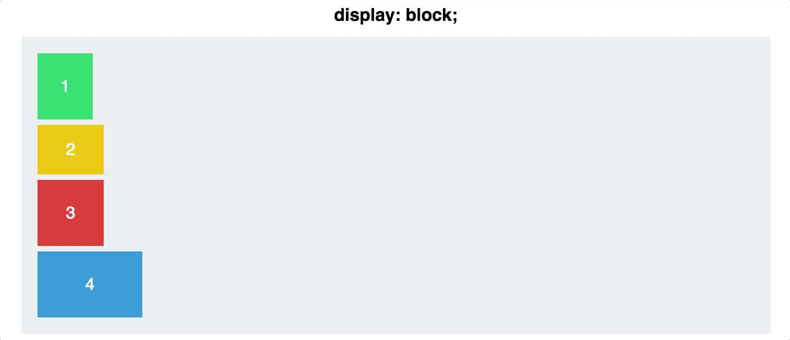

Flexbox
=====

# Grundlegendes

## Aufbau

Bei Flexbox gibt es jeweils ein Container Element, welches die `display`-Eigenschaft `flex` haben muss. Innerhalb des Container Elements, befinden sich die Items. Die möglichen CSS-Eigenschaften für Container und Items sind unterschiedlich:

### Container Eigenschaften
* display
* flex-direction
* flex-wrap
* flex-flow
* justify-content
* align-items
* align-content

### Item Eigenschaften
* order
* flex-grow
* flex-shrink
* flex-basis
* flex
* align-self

## Achsen

Ein Flexbox Container hat zwei Achsen. Die Hauptachse, auch "Main Axis" genannt, sowie die Querachse, auch "Cross Axis" genannt.

### Normale Achsen

Die Elemente innerhalb des Containers werden längs der Hauptachse positioniert. Dadurch sind sie Standardmässig nebeneinander.

### Gedrehte Achsen

Durch die CSS-Eigenschaft `flex-direction` werden die Hauptachse und die Querarchse um 90° gedreht. Die Elemente werden weiterhin an der Hauptachse positioniert. Dadurch wären die Elemente innerhalb des Containers nun untereinander.

# Container Eigenschaften

## Display

Flexbox aktivierst du, indem du auf deinem Container-Element die Display property auf Flex setzt.

Standardmässig sind Block-Elemente untereinander. Sobald du auf Container Flexbox aktivierst, rutschen die Elemente nebeneinander. Dies passiert, weil `flex-direction` Standardmässig auf `row` gesetzt ist.

HTML

    

      
1

      
2

      
3

      
4

    

CSS

    .container {
      display: flex;
    }

## Flex-direction

### Row vs Column

Mit `flex-direction` definierst du die Richtung der Elemente innerhalb des Containers auf der Hauptachse

### Reverse

Wenn du die Reihenfolge der Elemente umgekehren willst, kannst du `column` und `row` mit `-reverse` ergänzen.

## justify-content

Mit `justify-content` richtest du die Elemente innerhalb des Containers an der Hauptachse aus.

Wert | Effekt
---------|----------
flex-start | Die Elemente werden alle direkt nebeneinander positioniert. Das erste Element beginnt links, bzw oben an der Hauptachse. Falls die `flex-direction:` umgedreht wurde, beginnt es entweder rechts oder unten.
flex-end | Die Elemente werden alle direkt nebeneinander positioniert. Das erste Element beginnt rechts, bzw unten an der Hauptachse. Falls die `flex-direction:` umgedreht wurde, beginnt es entweder links oder oben.
space-around | Macht links und rechts von jedem element den gleichen Abstand. Da dies links und rechts passiert, gibt es zwischen den Elementen doppelt soviel Abstand wie neben den Elementen am Rand.
space-between | Macht zwischen allen Elementen, die sich nicht am Rand befinden, einen gleichmässigen Abstand. Die Elemente am Rand haben keinen Abstand zum Rand.
space-evenly | Macht zwischen allen Elementen einen gleichmässigen Abstand.
center | Zentriert alle Elemente in der Hauptachse.

## flex-wrap

    flex-wrap: nowrap | wrap | wrap-reverse

Standardmässig versucht der Browser, alle Flex Items auf einer Zeile darzustellen.

Um den Umbruch von Elementen zu erlauben, musst du die `flex-wrap` property setzen. Standardmässig ist die Eingenschaft auf `nowrap`gesetzt.
### Nicht umbrechen (Nowrap)

    .container {
      flex-wrap: nowrap;
    }

### Umbrechen (Wrap)

    .container {
      flex-wrap: wrap;
    }

### Von unten mmbrechen (Wrap reverse)

    .container {
      flex-wrap: wrap-reverse;
    }

## flex-flow

Ist eine Abkürzung um `flex-direction` und `flex-wrap` auf einmal zu setzten.

### Aufbau
Als erstes Argument gebt ihr die `flex-direction` an und als zweites Argument die `flex-wrap`-Eigenschaft.

    flex-flow: <flex-direction> || <flex-wrap>

### Beispiele

    flex-flow: row-reverse wrap
    flex-flow: row nowrap
    flex-flow: column-reverse wrap-reverse

## align-items

Definiert, wie die Elemente pro Zeile in der Querachse positioniert werden.

## align-content

Mit `align-content` definierst du, wie die Items in der Querarchse positioniert werden.

**Wichtig**: Diese Eigenschaft hat nur einen Effekt, wenn es mehr als eine Zeile von Items hat.

Wert | Beschreibung
-------- | --------
flex-start | Alle Items werden am beginn der Querachse positioniert und sind so nahe wie möglich beieinander.
flex-end | Alle Items werden Ende der Querarchse positioniert und sind so nahe wie möglich beieinander.
center | Die Elemente werden in der Mitte der Querachse positioniert und sind so nahe wie möglich beieinander.
space-between | lines evenly distributed; the first line is at the start of the container while the last one is at the end
space-around | lines evenly distributed with equal space around each line
stretch (default) | lines stretch to take up the remaining space

# Item Eigenschaften

## order

## flex-basis

## flex-grow

## flex-shrink

Basis-Wert 1

## flex

## align-self

# Holy Grail Layout mit Flexbox

Das Beispiel für das Holy Grail Layout mit Flexbox findest du auf [Codepen](https://codepen.io/chriscoyier/pen/vWEMWw).