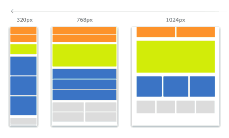

Media Queries
=======

Mit Media Queries könnt ihr unterschiedliche CSS Eigenschaften für unterschiedliche Ausgabegeräte definieren.

Ihr könnt also z.B. ein Hintergrundbild auf eurer Webseite ausblenden, wenn die Seite ausgedruckt wird, oder die Seite schmaler machen, wenn die Seite mit einem Handy besucht wird. Ihr könnt sämtliche CSS Eigenschaften innerhalb eines Media Query Blocks verwenden. Sie werden dann nur angewendet, wenn die Bedingungen des Media Query BLocks erfollt sind.

# Media Screen

Möchtest du CSS Regeln für alle Geräte mit Bildschirm definieren, musst du den Media Type `screen` verwenden. Nebst dem Bildschirm, kannst auch noch noch festlegen, welche Grösse das Browserfenster bzw. das Handy Display haben soll. Dabei kannst du entweder `min-width` für die minimal Grösse oder `max-width` für die maximal Grösse verwenden.

    @media screen and (min-width: 700px) {
        body {
            background-color: lightblue;
        }
    }

Diese CSS Regel definiert, dass der Body die Hintergrundfarbe `lightblue` hat, wenn das Medium Bildschirm ist **und** das Fenster mindestens `700px` Breit ist. Trifft eine der beiden Bedingungen nicht zu, so ist die Regel nicht aktiv und die Hintergrundfarbe wird nicht gesetzt.

## Responsive Design

In der Praxis verwendet man mehrere solcher Bläcke hintereinander um die Grössenbereiche für Handys, Tablets, schmaler Bildschirm, etc optimal darzustellen, auch "Responsive Design" genant. Dabei beginnt man das Styling meistens bei den Mobilen Endgeräten. Diesen Ansatz nennt man "Mobile First".

    * Styles für Smartphones */
    body {
      background-color: red;
    }

    /* Styles für Tablet und schmale Bildschirme */
    @media screen and (min-width: 700px) {
      body {
        background-color: lightblue;
      }
    }

    /* Styles für normale und grosse Bildschirme */
    @media screen and (min-width: 960px) {
      body {
        background-color: green;
      }
    }

Gute beispiele für Media Queries findest du auf [CSS Tricks](https://css-tricks.com/snippets/css/media-queries-for-standard-devices/)

# Media Print

Möchtest du für das Ausdrucken der Webseite andere Styles verwenden, so kannst du dies mit dem `@media print` Media Query machen.

    @media print {
      body {
        background-color: #ffffff;
        font-size: 10pt;
        font-family: Arial, Helvetica, sans-serif;
        color:#000000;
        padding:0;
        margin: 0;
      }
    }

# Weitere Media Queries

Es gibt noch weitere Media Queries wie z.B. die Pixeldichte oder die Orientierung des Gerätes. Diese sind leider nicht alle gut unterstützt. Eine Übersicht dazu findest du auf [cssmediaqueries.com](http://cssmediaqueries.com/overview.html).