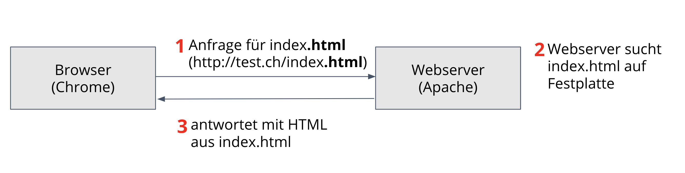
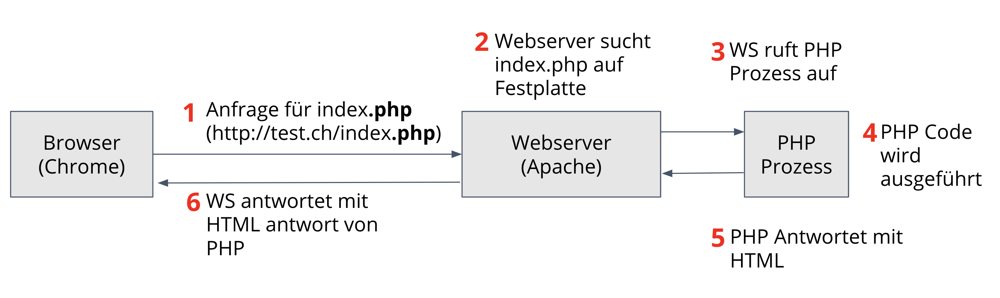

PHP Grundlagen
==============

PHP steht für **Hypertext Präprozessor**.
Früher Personal Homepage.

Läuft auch dem Server, nicht auf dem Browser des Benutzers.
Ist die meist verbereiteste Programmiersprache im Internet.

### Was kann man mit PHP machen?
- Formularverarbeitung, dann E-Mail verschicken
- Zahlen zusammen rechnen
- ... you name it

PHP macht eure Webseite schlau, ihr könnt Eingaben validieren und auf Aktionen von Benutzer reagieren.

# Tipps
* Auf genaue schreibweisen achten
* Beachtet die Fehlermeldungen von VSCode (mit der Maus drüber fahren)
* Nachschlagen auf [php.net](http://www.php.net)
* Weitere Beispiele findet ihr auf [Learn-PHP](https://www.learn-php.org/)

# Wie funktioniert eine HTML Anfrage
Hinter jeder Domain steht ein eindeutiger Server, der sich im gleichen Gebäude oder sonst irgendwo auf der Welt befinden kann. Dieser Server erhält die Anfrage und prüft dann ob, ob er darauf reagieren soll. Dann liefert er eine Antwort. Der Server an sich ist recht dumm.

Mit PHP ist dieser Ablauf etwas komplizierter. Der Browser stellt die Anfrage an den Server. Ist die Dateiendung PHP, stellt er fest, dass diese noch vom PHP Interpreter ausgeführt werden muss.
Der PHP Interpreter produziert als Resultat (nach der Verarbeitung des PHP-Files) HTML und gibt dieses dem Webserver zurück. Dieser wiederum liefert das HTML an den Browser zurück.

Ab heute funktioniert das Doppelklicken einer PHP Datei zur Ansicht im Browser nicht mehr. Der Browser kann PHP nicht verarbeiten und stellt den Inhalt der Datei einfach als Text dar.
Die Verarbeitung der PHP Datei funktioniert nur bei Aufrufen über `localhost`.

Der Aufruf von localhost zeigt standardmässig auf das Verzeichnis `htdocs` (ausser wenn du es anders konfiguriert hast).
Ist ausserdem im Verzeichnis `htdocs` keine index.php oder index.html Datei vorhanden. So zeigt der Webserver den Inhalt des Verzeichnisses als Liste an.

# PHP Datei erstellen
Die Datei muss die Endung `.php` besitzen, dass sie vom Server als solche interpretiert wird. Ausserdem muss am Anfang des ausführenden PHP-Codes das einleitende `<?php`

# Unterschied JavaScript <=> PHP
## PHP
Um PHP zu verarbeiten ist immer eine Anfrage an den Server erforderlich, deswegen ist mit PHP keine "Echtzeit" Reaktion auf Benutzereingaben möglich.

## JavaScript
JavaScript ermöglicht es, auch ohne Anfrage an den Server auf Eingaben vom Benutzer zu reagieren oder die Webseite interaktiv zu machen. Dies, weil JavaScript vom Browser ausgeführt wird.

# Hallo Welt (abspeichern als `test.php`)

    <!DOCTYPE html>
    <html>
    <body>
    <?php
        echo "Hallo Welt";
    ?>
    </body>
    </html>

# Einbettung PHP
Innerhalb einer PHP Datei kann beliebig oft ein PHP Block geöffnet und geschlossen werden.

    <h1>Test</h1>
    <?php echo "Hier wird was ausgegeben ?>
    
hier steht normales HTML

    <h2><?php
        echo "Hier geht PHP wieder los";
    ?>

Wenn am Ende der Datei kein weiteres HTML Markup mehr auftritt, muss das PHP Tag nicht mit `?>` abgeschlossen werden.

# echo
Der Befehl `echo` wird immer verwendet, wenn man etwas an den Browser ausgeben will.

# Fehlermeldungen
PHP Meldet euch Fehler wenn ihr den Syntax falsch schreibt. Im Fehler steht jeweils auch die Zeile auf welcher der Fehler aufgetretten ist. Diese Zeilennummer muss allerdings nicht immer stimmen, da sie nur aussagt, dass PHP den Code ab dieser Zeile nicht mehr verstanden hat, das Problem dazu kann aber auch schon weiter oben aufgetretten sein.

## Fehler anzeigen lassen

Standartmässig zeigt PHP keine Fehlermeldungen an, damit nicht aussversehen sensitive Informationen nach aussen gelangen. Für die lokale Entwicklung ist es aber hilfreich, die Fehler anzeigen zu lassen. Dazu muss in der `php.ini`-Datei, die Einstellung `display_errors` auf `On` gestellt werden. Eine Anleitung dazu findet ihr [hier](https://codingexplained.com/dev-ops/mac/enabling-php-error-reporting-mamp).

## Häufige Fehler

* ; (Semikolon) am Ende vergessen
* $ bei Variablenname vergessen
* "" oder ' ' oder ( ) oder { } nicht korrekt abgeschlossen
* allgemeine Schreibfehler im Syntax (z.B. `eco` statt `echo`)
* `+` mit `.` verwechselt

# Kommentare

Wie vielen weiteren Programmier- und Markup-Sprachen gibt es auch in PHP die Möglichkeit, Codestellen zu kommentieren oder zwischenzeitlich "auszukommentieren" => zu deaktivieren.

Dies macht man wie folgt:

    // Einzeiliger Kommentar mit Doppelslash

    /* Mehrzeiliger Kommentar
       mit Slash Stern / Stern Slash
       So geht das.
    */

# Variablen erstellen
Variablen ein vorangestelltes `$` Zeichen, dieses liest man auch als "Dollar". Eine Variable könnte also beispielsweise `$test` heissen. Prinzipiell können Buchstaben (ausgenommen Umlaute), _ (Underlines) und Zahlen als Variablennamen verwendet werden.
Ausserdem gibt es sogenannte reservierte Wörter, welche ebenfalls nicht als Variablennamen verwendet werden können.

Werte werden einer Variable mittels einem Gleichheitszeichen `=` zugewiesen. Ein Wert der einer Variable zugewiesen wurde kann später wieder z.B. mittels `echo $variablenneame;` aus dieser Variable "herausgeholt" werden.

Solange die Variable nicht überschrieben oder "gelöscht" wird, bleibt der Wert in der Variable enthalten.

Überschreiben kann man einen Wert in einer Variable, indem man mittels einer erneuten Zuweisung `$test = 'wert';` einen neuen Wert in die Variable "speichert".

# Bespiel Variablen / Zuweisung

    <?php
    $mwst = 1.077;
    $zahl1 = 5;
    $zahl2 = 10;
    $resultat = $zahl1 * $zahl2; // Resultat berechnen

    $resultat = $resultat * $mwst; // Neuer Wert wird Variable $resultat zugewiesen

    echo $resultat;
    ?>

# Datentypen
Zwei der grundlegenden Datentypen in PHP sind *integer* und *string*

    $test = "Ich bin ein String"; // Ein String wird mit einfachen oder doppelten Gänsefüsschen ausgezeichnet.

    $zahl = 5; // Ich bin ein Integer

Datentypen definieren verschiedene Arten, wie Daten im Speicher des Computers abgelegt werden. Sie ermöglichen ausserdem, unterschiedliche Dinge mit ihnen anzustellen.

    $test = true; // Ich bin ein boolean

    $foo = 1; // Ich bin ein Integer (Ganzzahl)

    $bar = "Ich bin ein String"; // Ich bin ein String

    $ganzGenau = 1.5; // Ich bin ein Double (Gleitkommazahl)

    $leer = null; // Variable ist definiert, aber leer

Rechnen kann man zum Beispiel nur mit Variablen vom Typ Integer & Double.

# Arithmetische Operationen

    + // Addition

    - // Subtraktion

    * // Multiplikation

    / // Division

    % // Ganzzahliger Rest einer Division (z.B. `1 % 4` ergibt 1, da sich 1 gar nicht durch 4 teilen lässt)

    ++ // Zählt den Wert einer Variable um 1 hoch

    -- // Verringert den Wert einer Variable um 1

## Beispiele

    <?php
    echo 5 + 1; // 6

    echo 5 * 5; // 25

    echo 35 / 7; // 5

    echo 5 - 5; // 0

    echo 25 / 0; // Warning: Division bei Zero

    echo 0 / 25; // 0

    // Prä- und Post-Increment

    $a = 5;
    $b = 5;

    echo $a++; // 5, ist identisch mit `$a = $a + 1;` weil Post-Inkrement
    echo $a; // 6

    echo ++$a; // 6, da vor der Ausgabe die Inkrementierung durchgeführt wird (Prä-Inkrement)
    echo $b; // 6

    // Bonus

    $c = 1;

    $c += 1; // identisch wie $i++

    $c += 10; // 12

    $c -= 2; // 10

## Rechnen mit Zahlen und Variablen

    $a = 5;

    echo 5 + $a;

# Verketten von Variablen (Konkatenieren)

Mittels einem `.` kann man mehrere Strings miteinander verbinden.

    <?php
    $vorname = "Hugo ";
    $nachname = "Fisch";

    echo $vorname.$nachname;

Gleichermassen kann man mit einem `.=` einen String einem anderen String anhängen.

    <?php
    $name = "Hans";
    $name .= " Wurst"; // Variable enthält nun "Hans Wurst"

    echo $name; // Hans Wurst

Es können jeweils auch mehr als zwei Strings miteinander verkettet werden.

    $vorname = "Hans ";
    $middle = "Martin ";
    $nachname = "Müller";

    echo $vorname . $middle . $nachname; // Hans Martin Müller

Anstatt die Leerzeichen "manuell" im Namen einzupflegen, kann man die Leerzeichen auch beim Verketten einfügen.

    $vorname = "Hans";
    $middle = "Martin";
    $nachname = "Müller";

    echo $vorname . " " . $middle . " " . $nachname; // Hans Martin Müller

    $anrede = "Sehr geehrter Herr " . $nachname;
    echo $anrede; // Sehr geehrter Herr Müller

# Doppelte und einfache Anführungszeichen

Innerhalb eines Strings welcher mit doppelten Hochkommas definiert wurde, interpretiert PHP Variablen welche mit `$` beginnen. Will man, dass ein $ Zeichen nicht als Variable interpretiert wird, so kann man den String auch mit einfachen Hochkommata definieren.

    $wird = "Hallo";
    $test = 'hier $wird zum beispiel keine variable interpretiert';
    echo $test; // hier $wird zum beispiel keine variable interpretiert

# Kontrollstrukturen

Kontrollstrukturen erlauben es euch, Weichen in euren Code einzubauen. Der Code läuft also nicht mehr "linear" von oben nach unten, sondern gewisse Stellen werden je nach Bedingung ausgelassen.

## if

- Der Teil innerhalb der runden Klammern wird als Bedingung bezeichnet.
- Der Teil innerhalb der geschweiften Klammern wird als Block bezeichnet.

### Code Beispiel
    $t = date("G");

    if ($t < 20) {
        echo "Es ist Tag.";
        /* Befehle innerhalb der geschweiften Klammer werden nur         ausgeführt, wenn die Bedingung innerhalb der runden Klammer *true* (wahr) ist. */
    }

## Vergleichsoperatoren
Operator | Beschreibung
------- | --------
`<`   |   Wert links ist kleiner als Wert rechts
`>`   |   Wert links ist grösser als Wert rechts
`==`  |   Wert ist gleich Wert rechts (Datentypen werden ignoriert)
`==`  |   Wert ist identisch zum Wert rechts (Datentypen müssen auch gleich sein)
`<=`  |   Wert links ist kleiner oder gleich Wert rechts
`>=`  |   Wert links ist grösser oder gleich Wert rechts

## Logische Operatoren

Operator | Beschreibung
---------|-------------
`&&`  |   Bedingung 1 *und* Bedingung 2 müssen true sein
`||`  |   Bedingung 1 *oder* Bedingung 2 müssen true sein

### Beispiel

    // UND Verknüpfung
    $tag = 1;
    $week = 2;

    if ($tag == 1 && $week == 2) {
        echo 'Wahr';
    }

    // ODER Verknüpfung
    $tag = 5;
    $week = 2;

    if ($tag == 1 || $week == 2) {
        echo 'Wahr';
    }

## if / else

Zusätzlich zum `if` (entweder) Statement gibt es ein `else` (oder) Statement. Dieses wird ausgeführt, wenn das `if` Statement nicht `true` (Wahr) ist.

    $a = 2;

    if ($a == 1) {
        echo 'wahr';
    } else {
        echo 'falsch';
    }

## date()

Gibt einen formatierten String anhand eines vorzugebenden Musters zurück. Dabei wird entweder der angegebene Timestamp oder die gegenwärtige Zeit berücksichtigt, wenn kein Timestamp angegegeben wird. Mit anderen Worten ausgedrückt: der Parameter Timestamp ist optional und falls dieser nicht angegeben wird, wird der Wert der Funktion time() angenommen.

### Gängige Formate
Format | Beschreibung
-------|-------------
d |  Tag 2 stellig mit führeneder 0
m |  Monat 2 stellig mit führender 0
Y |  Jahr 4 stellig
H |  Stunde im 24h Format
i |  Minuten
s |  Sekunden

### Beispiel

    echo date('d'); // 12

    echo date('d.m.Y') // 12.01.2019

    echo date('d.m.Y H:i:s'); // 12.01.2019 10:05:10

## time()

Gibt die seit Beginn der Unix-Epoche (`Januar 1 1970 00:00:00 GMT`) bis jetzt vergangenen Sekunden zurück.

### Beispiel

    echo time(); // 1547284074

## getdate()

Gibt ein assoziatives array mit Datums- und Zeitangaben des angegebenen timestamp zurück. Ist kein Timestamp angegeben, wird die lokal gültige Zeit verwendet.

Da diese Funktion mehrere Werte (Array) zurück gibt, kann man nicht einfach `echo getdate();` ausführen.

Will man den Inhalt einer beliebigen Variable anzeigen lassen (inkl. Arrays), so kann man die Funktion `var_dump()` verwenden.

### Beispiel

    echo getdate(); // gibt einen Fehler aus

    var_dump(getdate());

#### Ausgabe

    Array
    (
        [seconds] => 40
        [minutes] => 58
        [hours]   => 21
        [mday]    => 17
        [wday]    => 2
        [mon]     => 6
        [year]    => 2003
        [yday]    => 167
        [weekday] => Tuesday
        [month]   => June
        [0]       => 1055901520
    )

Will man nun zum Beispiel die `hours` aus dieser Funktion beziehen, so macht man das wie folgt:

    $now = getdate();

    echo $now['hours']: // 21

## if / elseif / else

Zusätzlich zu `if` und `else` gibt es auch noch `elseif`.
Während bei mehreren `if`-Blöcken jede Bedingung wahr sein kann, ist es bei `elseif` so, dass die Bedingung nur geprüft wird, wenn die davorliegende Bedinungung _nicht_ wahr ist.

### Beispiel mit if

    $a = 5;

    if ($a == 5) {
        echo 'ist fünf ';
    }

    if ($a < 10) {
        echo 'ist kleiner 10 ';
    }

    if ($a < 20) {
        echo 'ist kleiner 20 ';
    }

#### Ausgabe
    ist fünf
    ist kleiner 10
    ist kleiner 20

### Beispiel mit if/elseif/else

    $a = 5;

    if ($a == 5) {
        echo 'ist fünf ';
    } else if ($a < 10) {
        echo 'ist kleiner 10 ';
    } else {
        echo 'ist kleiner 20 ';
    }

    Ausgabe:
    ist fünf

## switch/case/default

Switch ist eine Alternative zu einem if/elseif/else Konstrukt. Bei einem Switch/Case gibt es keine geschweiften Klammern. Ein "Block" wird mit dem Schlüsselwort `break;` abgeschlossen.

Schliesst man einen `case` nicht `break;` ab, so wird ohne Prüfung die Anweisung im nächsten `case` ausgeführt (oder in mehreren nächsten `case`s, solange bis ein `break;` kommt oder das switch-Statement fertig ist).

Mit dem case `default` kann man ähnlich dem `else` bei if/else den "anderen" Fall beschreiben. Wird vor dem `default` nicht gebreakt, wird der `default` ebenfalls ausgeführt.

### Beispiel

    $monat = date("F");

    switch($monat) {
        case "Januar":
            echo "Es ist Frühling";
        break;

        case "Februar":
            echo "Es ist Frühling";
        break;

        case "March":
            echo "Es ist Frühling";
        break;
    }

#### Ausgabe
    Es ist Frühling

Beispiel ohne `break;`

    $monat = date("F");

    switch($monat) {
        case "Januar":
            echo "Es ist Frühling";

        case "Februar":
            echo "Es ist Frühling";
        break;

        case "March":
            echo "Es ist Frühling";
        break;
    }

#### Ausgabe
    Es ist FrühlingEs ist Frühling

Dieses Verhalten können wir uns zunutze machen

    $monat = date("F");

    switch($monat) {
        case "Januar":
        case "Februar":
        case "March":
            echo "Es ist Frühling";
        break;
    }

#### Ausgabe
    Es ist Frühling

Beispiel mit `default`

    $monat = "hahahaha"

    switch($monat) {
        case "Januar":
        case "Februar":
        case "March":
            echo "Es ist Frühling";
        break;

        default:
            echo "keine Jahreszeit";
    }

#### Ausgabe
    keine Jahreszeit

# Schleifen

Schleifen werden verwendet, um eine Code-Stelle mehrere Male zu wiederholen.

## while-Schleife

Die while-Schleife hat eine Abbruchbedingung, welche nach jedem Durchlauf der Schleife geprüft wird. So lange die Bedingung `true` (Wahr) ist, wird die Schleife erneut durchlaufen.

    while(Abbruchbedingung) {
        // beliebige Anweisungen
    }

### Beispiel

    <?php
    $zahl = 1;

    while($zahl <= 100) {
        echo "$zahl ";
        $zahl++;
    }

# Interaktion mit PHP

Bisher hatten die Skripts jeweils einen linearen Ablauf; sie waren nicht "interaktiv" und haben keine Daten vom Benutzer entgegengenommeen und verarbeitet. Die Fähigkeit auf Benutzereingaben zu reagieren ist jedoch essenziell.

Denkt man zum Beispiel an einen Online-Shop, so gibt es jeweils eine Produkteübersicht, auf welcher man mittels einem Mausklick auf die Detailseite gelangen kann.

Beispielsweise hätten wir dann zwei Dateien:
- overview.php
- detail.php

Die Idee ist nun, dass man mit ein und derselben `detail.php` Datei unterschiedliche Ausgaben (je nach Produkt) erzeugen kann.

So wäre auf der Seite `overview.php` ein Anchor Element enthalten, dass wie folgt aussieht:

    <a href="detail.php?articleId=494994">Produkt 1</a>

    <a href="detail.php?articleId=483724">Produkt 2</a>

Im Skript `detail.php` kann man dann auf die hinter dem `?` angehängten Parameter reagieren und je nach dem Informationen zum Produkt 1 oder Produkt 2 anzeigen.

Wie man das macht, sehen wir in den folgenden Abschnitten.

## GET

Per GET Parameter kann man dem PHP Skript Daten übergeben.
In der Adresszeile des Browsers sieht ein GET-Parameter wie folgt aus:

    http://localhost/meinSkript.php?name1=wert

Im deinem PHP Skript kannst du den Wert des GET-Parameters `name1` verwenden. Dieser Wert befindet sich in einer globalen Variable namens `$_GET`.

    $name = $_GET['name1'];

    echo $name;

### Ausgabe
    wert

Bei der Entgegennahme von Benutzereingaben via GET-Parametern solltest du auf jedenfall prüfen, dass die Eingabe den Erwartungen deiner Software entspricht. Sonst kann der Benutzer deine Software mit unerwarteten Eingaben zum Absturz bringen.

## POST

Per POST Parameter kann man dem PHP Skript Daten übergeben. Diese sind nicht in der Adresszeile des Browsers ersichtlich, werden aber trotzdem an den Server übertragen. Dies passiert im Hintergrund (man kann diese aber via Browser Entwicklungstools sichtbar machen).

Das arbeiten mit POST Daten im PHP Skirpt ist identisch wie bei den GET Daten, die Variable heisst allerdings `$_POST`

    $name = $_POST['name1'];

    echo $name;

### Ausgabe
    wert

# Schleifen
Will man eine Zählschleife implementieren, muss man bei der Verwendung einer `while` Schleife jeweils oft das immer gleiche Grundmuster schreiben.

    $zahl = 1;
    while ($zahl < 100) {
        // zu wiederholender code

        $zahl++;
    }

## for
Eine kürzer Schreibweise für eine Zählschleife bietet uns die `for` Schleife an. Die

    for (Startzustand; Abbruchkriterium; Anweisung nach jedem Durchgang) {
        // zu wiederholender code
    }

Möchte man obenstehende `while` Schlaufe mit einer `for` Schleife umsetzen, würde diese so aussehen:

    for ($zahl = 1; $zahl < 100; $zahl++) {
        // zu wiederholender code
    }

Dabei kann man selbstverständlich auch abwärts zählen.

    for ($zahl = 100; $zahl > 1; $zahl--) {
        // zu wiederholender code
    }

# Arrays
Normale Variablen (Integer, String, ...) können immer nur einen Wert enthalten. Mit Hilfe von Arrays kann eine Variable nun mehrere Werte enthalten (ähnlich einer Liste).

Dabei wird zwischen den folgenden Array-Arten unterschieden:
    - Indizierte Arrays (Zugriff erfolgt mittels nummerischem Schlüssel)
    - Assoziative Arrays (Zugriff erfolgt mittels String/Text Schlüssel)
    - Mehrdimensionale Arrays (Array welcher wiederum Arrays enthält)

## Indizierte Arrays
Will man eine beliebige Anzahl von Werten in einen Array einfüllen, muss man folgende Schreibweise anwenden:

    // Neue Schreibweise
    $vorname = ['Hans', 'Peter', 'Wolfgang'];

    // Alte Schreibweise
    $vorname = array('Hans', 'Peter', 'Wolfgang');

    // Manuelles Befüllen
    $vorname[0] = 'Hans';
    $vorname[1] = 'Peter';
    $vorname[2] = 'Wolfgang';

Nun habt ihr die Variable `$vorname` mit 3 Vornamen gefüllt; die Variable `$vorname` ist nun ein indiziertes Array.
Will man den Inhalt dieser Variable ausgeben, so kann man nicht mehr einfach `echo $vorname;` schreiben, da nicht definiert ist, welcher der Vornamen angezeigt werden soll.

Der Zugriff auf einen einzelnen Namen erfolgt mittels einem Index (oder auch Schlüssel). Diesr Schlüssel ist bei indizierten Arrays nummerisch (also eine Zahl).

    $vorname = ['Hans', 'Peter', 'Wolfgang'];

    echo $vorname[0]; // Hans
    echo $vorname[1]; // Peter
    echo $vorname[2]; // Wolfgang

**Wichtig zu wissen ist dabei noch, dass das erste Element immer bei Index 0 eingefügt wird (nicht bei Index 1).**

Es können ausserdem auch leere Arrays erstellt werden. Dafür lässt man die "Liste" einfach leer:

    $cars = []; // erstellt ein leeres Array $cars z.B. für die spätere Verwendung

    echo count($cars); // 0

Abgesehen von Strings kannst du natürlich auch beliebige andere Datentypen in dein Array einfüllen. Es müssen dabei auch nicht alle Einträge vom selben Datentyp sein, Mischen ist möglich.

    // Werte sind Integers
    $zahlen = [5, 10, 15, 20];

    // Werte sind booleans
    $wahr = [false, true, true, false, true, false];

    // Werte sind gemischt
    $gemischt = [5, 'Hanswurst', true];

### count()
Um zu prüfen, wieviele Elemente sich in einem Array befinden, kannst du die Funktion `count($vorname)` verwenden. Diese gibt dir die Anzahl der Vornamen zurück.

    $vorname = ['Hans', 'Peter', 'Wolfgang'];

    echo count($vorname); // 3

Setzt du nun `count()` geschickt ein, so kannst du Code schreiben, welcher jeweils den letzten Namen des Arrays zurückgibt.

    $vorname = ['Hans', 'Peter', 'Wolfgang'];

    $anzahl = count($vorname);

    echo $vorname[$anzahl - 1]; // Wolfgang

Das `- 1` ist nötig, weil `count()` die Anzahl Einträge zurückgibt, der Schlüssel jedoch bei 0 beginnt. Der dritte Eintrag befindet sich bei Index 2.

### Über Arrays loopen
Früher hat man mittels einer Zählschleife alle Einträge aus einem Array ausgegeben:

    $vorname = ['Hans', 'Peter', 'Wolfgang'];

    // Alte Version
    for($i = 0; $i < count($vorname); $i++) {
        echo $vorname[$i].' ';
    }

#### Ausgabe
    Hans
    Peter
    Wolfgang

Wird der Array beim Befüllen um einen weiteren Eintrag ergänzt, so wird dieser von selbst auf der 4. Zeile ausgegeben.

Um jeden Eintrag eines Arrays auszugeben, gibt es noch eine spezielle Art von Loop. Dieser heisst `foreach`.  Die Schreibweise ist dabei wie folgt:

    foreach ($herkunftsArray as $wertImLoop) {
        // $wertImLoop stellt nun bei jedem Durchgang
        // jeweils einen Wert aus dem Array zur Verfügung
    }

    $vornamen = ['Hans', 'Peter', 'Wolfgang'];

    foreach($vornamen as $vorname) {
        echo $vorname.' ';
    }

#### Ausgabe
    Hans
    Peter
    Wolfgang

Das Verhalten beim Loopen über ein Array kann man zusätzlich mit den Befehlen `break;` und `continue;` steuern.

#### break
Verlässt den `foreach()` Loop, der Code unterhalb des Loops wird als nächsts ausgeführt.

#### continue
Verlässt den aktuellen Durchgang des Loops und startet den nächsten Durchgang (mit dem nächsten Element)

## Assoziative Arrays
Anstelle einer fortlaufenden Nummerierung kann man bei assoziativen Arrays einen String als Schlüssel verwenden.

Zum Befüllen eines assoziativen Arrays muss man folgende Schreibweise anwenden. Wichtig ist dabei die Verwendung des `=>` Pfeils, welcher die Verbindung (Assoziation) zwischen dem Schlüssel und dem Wert herstellt.

**Wichtig ist, dass die Schlüssel einigartig sind. Verwendet man einen Schlüssel ein zweites Mal, so wird der Inhalt aus der ersten Zuweisung überschrieben.**

    $ages = ['Schluessel' => 'Wert', 'Schluessel1' => 'Wert1', ...]:

Beispiel:

    // Neue Schreibweise
    $ages = ['Peter' => 10, 'Fritz' => 98, 'Pascal' => 17];

    // Alte Schreibweise
    $ages = array ('Peter' => 10, 'Fritz' => 98, 'Pascal' => 17);

    // Manuelle Zuweisung
    $ages['Jonathan'] = 89;
    $ages['Jakob'] = 104;

Will man nun auf einen dieser Werte zugreifen, verwendet man den entsprechenden Namen als Schlüssel.

    $ages = ['Peter' => 10, 'Fritz' => 98, 'Pascal' => 17];

    echo $ages['Fritz']; // 98
    echo $ages['Peter']; // 10
    echo $ages['Pascal']; // 17

### Über Arrays loopen bei assoziativen Arrays
Zusätzlich zum Wert, welchen wir beim indizierten Array bei jedem Durchgang einer Variable zugewiesen haben, können wir auch den Schlüssel (Key), einer Variablen zuweisen.

    foreach ($herkunftsArray as $schluesselImLoop => $wertImLoop) {
        // $schluesselImLoop stellt nun bei jedem Durchgang
        // den Schluessel des aktuellen Werts zur Verfügung
        //
        // $wertImLoop stellt nun bei jedem Durgang
        // jeweils einen Wert aus dem Array zur Verfügung
    }

Beispiel:

    $ages = ['Peter' => 10, 'Fritz' => 98, 'Pascal' => 17];

    foreach ($ages as $name => $age) {
        echo $name . ' ist ' . $age . ' Jahre alt. ';
    }

Wichtig ist auch hier die Schreibweise mit dem Pfeil `=>`

## nützliche Funktionen *var_dump()* und *print_r()*
Will man den Inhalt einer beliebigen Variable, sei es String, Integer oder Array, inspizieren, so kann man `var_dump()` oder `print_r()` verwenden.

    // Variablen befüllen
    $name = 'Tim';
    $personen = ['Heinz', 'Rüdiger','Thomas'];

    // Ausgabe vorbereiten
    echo '<pre>'; // HTML Element, damit die Formatierung erhalten bleibt
    var_dump($name);
    var_dump($personen);
    echo '</pre>';

### Ausgabe
    string(3) "Tim"

    array(3) {
    [0]=> string(5) "Heinz"
    [1]=> string(8) "Rüdiger"
    [2]=> string(6) "Thomas"
    }

## Mehrdimensionale Arrays
In ein Array kann man abgesehen von primitiven Datentypen wie Integer, String, Boolean, ... auch komplexe Datentypen wie z.B. ein weiteres Array einfüllen.
Um ein weiteres Array innerhalb eines Arrays zu erzeugen, schreibt man statt einem simplen Wert einfach ein neues Array mit eckigen Klammern `[]`. Dieses kann leer oder ebenfalls bereits gefüllt sein.

    // Zwei indizierte Arrays ineinander verschachtelt

    $mehrDimensionalesArray = [ // Hauptarray
        ['A1', 'A2'], // Array A
        ['B1', 'B2'], // Array B
    ];

    echo $mehrDimensionalesArray[0][0]; // A1

    echo $mehrDimensionalesArray[0][1]; // B1
    echo $mehrDimensionalesArray[1][1]; // B2

Es können alle möglichene Arten, indizierte und assoziative Arrays, innerhalb eines anderen Arrays verschachtelt werden.

    // Indiziertes Array innerhalb eines assoziativen Arrays

    $lieblingsFarben = [ // Hauptarray
        'Walter' => ['blau', 'grün'],
        'Roman' => ['gelb'],
        'Nina' => ['braun', 'rosa'],
    ];

    echo $lieblingsFarben['Nina'][0]; // braun
    echo $lieblingsFarben['Walter'][1]; // grün

Will man aus obigem Beispiel alle Daten ausgeben, so kann man wiederum den `foreach()` anwenden.

    $lieblingsFarben = [ // Hauptarray
        'Walter' => ['blau', 'grün'],
        'Roman' => ['gelb'],
        'Nina' => ['braun', 'rosa'],
    ];

    foreach ($lieblingsFarben as $name => $farben) {
        echo $name . ' hat ' . count($farben) . ' Lieblingsfarben. ';
    }

### Ausgabe
    Walter hat 2 Lieblingsfarben.
    Roman hat 1 Lieblingsfarben.
    Nina hat 2 Lieblingsfarben.

Öfter trifft man jedoch den umgekehrten Fall an. Beliebig viele assoziative Arrays befinden sich innerhalb eines indizierten Arrays.

    $cars = [
        ['marke' => 'Volvo', 'lager' => 10, 'bestellt' => 5],
        ['marke' => 'BMW', 'lager' => 120, 'bestellt' => 592],
        ['marke' => 'Landrover', 'lager' => 1, 'bestellt' => 10],
        ['marke' => 'VW', 'lager' => 254, 'bestellt' => 24],
    ]

    foreach ($cars as $index => $car) {
        echo $i . ' Bestand für Marke ' . $car['marke'] . ', Lager ' . $car['lager'] . ', bestellt ' . $car['bestellt] . ' ';
    }

### Ausgabe
    0 Bestand für Marke Volvo, Lager 10, bestellt 5
    1 Bestand für Marke BMW, Lager 120, bestellt 592
    2 Bestand für Marke Landrover, Lager 1, bestellt 10
    3 Bestand für Marke VW, Lager 254, bestellt 24

**Merke:** Kennst du die Art der Daten innerhalb eines Arrays, und möchtest du diese allenfalls später um zusätzliche Daten-Arten ergänzen (z.B. bei oben stehendem Auto-Beispiel noch den Typ), so lohnt es sich, jeweils ein assoziatives Array zu verwenden.

# Funktionen
Bisher haben wir bereits an diversen Stellen Funktionen eingesetzt. Zum Beispiel `count()` ist eine Funktion.

Innerhalb der runden Klammern haben wir jeweils unser zu zählendes Array eingesetzt. Diesen Teil einer Funktion nennt man *Parameter*. Der Teil `count` (vor den runden Klammern) ist der Name der Funktion.
Eine Funktion *kann* ausserdem etwas zurückgeben (aus der Funktion heraus), damit man mit diesem Wert weiter arbeiten kann.

## Funktions-Definition
Die Definition einer eigenen Funktion sieht wie folgt aus:

    function nameDerFunktion($parameeter1, $parameter2, ...) {
        // Code welcher die Funktion ausführt
        return $returnWert; // Optionaler Returnwert
    }

Es gibt auch Funktionen die keinen Paramter erwarten und/oder auch nichts zurück geben (kein Returnwert):

    function nameDerFunktion() {
        echo 'Hallo Welt';
    }

## Funktionsaufruf
Eine Funktion ist wie eien Werkzeug, das Werkzeug müsst ihr euch erst "bauen" und danach "verwenden". Dieses Verwenden nennt man *Funktionsaufruf*

    // Funktionsdefinition
    function nameDerFunktion() {
        echo 'Hallo Welt';
    }

    // bisher wird noch nicht ausgegeben, da niemand die Funktion verwendet.

    nameDerFunktion(); // diese Zeile ruft die Funktion auf

### Ausgabe
    Hallo Welt

## Gültigkeit der Variablen (Scope)

    $test = 1; // diese Variable ist global

    function halloWelt() {
        $test = 1; // diese Variable ist nur innerhalb der Funktion gültig
    }

Will man mit dem Wert einer Variable ausserhalb der Funktion weiterarbeiten, z.B. um ihn mit `echo` auszugeben, so muss ich diesen Wert aus der Funktion zurück an die "globale Welt" geben.

    $test = 1; // globale Variable, da ausserhalb der Funktion definiert

    function halloWelt() {
        $test = 1; // lokale Variable, da innerhalb der Funktion definiert
        $test = $test * 4;

        return $test;
    }

    echo $test;
    echo ' ';
    echo halloWelt();

### Ausgabe
    1
    4

Beim obigen Beispiel sieht man auch, dass die Variablen innerhalb und ausserhalb der Funktion sich *nicht* gegenseitig beeinflussen.

## Einfaches Beispiel einer Funktion mit Parametern und Return

    function meierify($vorname) {
        return $vorname . ' Meier';
    }

    echo meierify('Hans');
    echo ' ';
    echo meierify('Hugo');
    echo ' ';
    echo meierify('Pascal');
    echo ' ';

## Ausgabe
    Hans Meier
    Hugo Meier
    Pascal Meier

Eine Funktion kann auch mehrere Paramter erwarten, dabei ist der erste Wert, den man beim Funktionsaufruf mitgibt jeweils im 1. Parameter zu finden, der zweite jeweils im 2. Parameter.

    function meierify($vorname, $geschlecht) {
        if ($geschlecht == 'f') {
            $anrede = 'Frau';
        } else {
            $anrede = 'Herr';
        }

        return $anrede . ' ' . $vorname . ' Meier';
    }

    echo meierify('Andrea', 'f');
    echo ' ';
    echo meierify('Hugo', 'm');
    echo ' ';
    echo meierify('Pascal', 'm');
    echo ' ';

### Ausgabe
    Frau Andrea Meier
    Herr Hugo Meier
    Herr Pascal Meier

## Standardwerte für optionale Parameter
Entwickelt ihr eine eigene Funktion welche 1-2 Parameter erwartet, so müsst ihr für den optionalen Parameter einen Standardwert definieren. Ansonsten gibt es einen Fehler.

Der Standardwert im Parameter gesetzt, sofern dafür nicht beim Aufruf explizit ein Wert in die Funktion gegeben wurde.

    function meierify($pflichtParameter, $optionalerParameter = 'f') {
        if ($optionalerParameter == 'f') {
            $anrede = 'Frau';
        } else {
            $anrede = 'Herr';
        }

        return $anrede . ' ' . $pflichtParameter . ' Meier';
    }

    echo meierify('Andrea');
    echo ' ';
    echo meierify('Hugo', 'm');
    echo ' ';
    echo meierify('Pascal');
    echo ' ';

### Ausgabe
    Frau Andrea Meier
    Herr Hugo Meier
    Frau Pascal Meier

## Beispiele MwSt. Rechner

    function mwst($preis) {
        $total = $preis * 1.077;
        return $total;
    }

    $preis = 100;
    $preisMitMwst = mwst($preis);

    echo "Der Preis ist: $preis (ohne Mwst) und $preisMitMwst (inkl. Mwst)";

## Beispiele MwSt. Rechner flexibel

    function mwst($preis, $faktor = 1.077) {
        $total = $preis * $faktor;
        return $total;
    }

    $preis = 100;
    $preisMitMwst = mwst($preis); // kein expliziter 2. Parameter

    $preisMitMwstDe = mwst($preis, 1.19); // 2. Parameter gesetzt, überschreibt Standardwert.

    echo "Der CH-Preis ist: $preis (ohne Mwst) und $preisMitMwst (inkl. Mwst) ";
    echo "Der DE-Preis ist: $preis (ohne Mwst) und $preisMitMwstDe (inkl. Mwst) ";

## Return Early

Sobald `return` aufgerufen wird, bricht die weitere Verarbeitung des Programm-Codes innerhalb der Funktion ab und der Wert wird sofort zurückgegeben.

Dieses Verhalten kann man sich zunutze machen.
Im untenstehenden Beispiel prüfen wir den Parameter, welcher der Funktion mitgegeben wird. Entspricht dieser nicht unseren Vorstellungen, brechen wir die weitere Verarbeitung der Funktion ab und returnen.

Der Wert für `return` kann dabei auch weggelassen werden.

    function whatEver($wert) {
        if ($wert != 'floats your boat') {
            return;
        }

        echo 'hierher kommt das programm nur, wenn "$wert = floats your boat" ist';
    }

    echo whatEver('');
    // gibt nichts aus

    echo whatEver('floats your boat');
    // gibt hierher kommt das programm nur, wenn "$wert = floats your boat" ist
