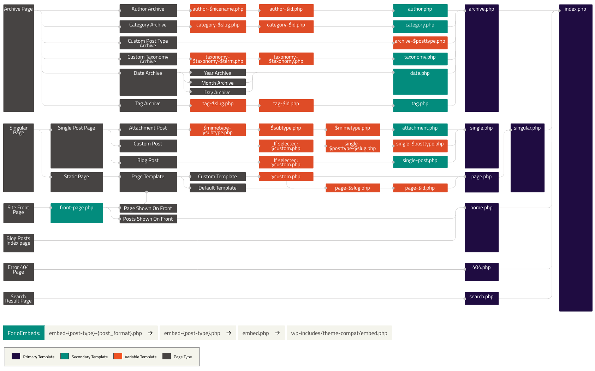

Themes entwickeln
=================

# Erste Schritte
Erstellt in eurem Wordpress Ordner unter `wp-content/themes` einen leeren Ordner und nennt ihn so, wie euer Theme heissen soll.

Beachten: Keine Leerzeichen, keine Umlaute oder ungewohnte Sonderzeichen. Bindestriche wie z.B: `mein-super-theme` sind ok.

Danach müsst ihr im Ordner 2 Dateien, `index.php` und `style.css`, anlegen.

# Style.css

Damit Wordpress euer Theme erkennt, müsst ihr folgende Kommentare oben an euer `style.css` anfügen:

    /*
    Theme Name: rolf
    Theme URI: http://kunstwort.com/rolf
    Description: Template von Rolf
    Author: Rolf Eggenberger
    Author URI: http://kunstwort.com
    */

Die Wörter links vom `:` müssen genau so übernommen werden, alles rechts vom `:` könnt ihr nach euren Wünschen anpassen.

Feld  | Beschreibung
---------|----------
Theme Name | Name eures Themes
Theme URI | Addresse eures Themes, z.B. wenn ihr es verkaufen möchtet
Description | Beschreibung eures Themes
Author | Euer Name
Author URI | Addresse von euch oder eurer Firma

# index.php

##The Loop

Die Grundstruktur des Loops sieht folgendermassen aus:

    <?php if (have_posts()) : while (have_posts()) : the_post(); ?>
      <h2><?php the_title(); ?></h2>
      

          <?php the_content(); ?>
      

    <?php endwhile; endif; ?>

Beachtet die speziellen `if (BEDINGUNG) : while (have_posts()) : the_post()` Elemente:

Die Funktionen innerhalb des Loops sind:

Funktion  | Beschreibung
---------|----------
have_posts() | Gibt `true` zurück, wenn mindestens ein Post auf der Seite besteht, der noch nicht abgearbeitet wurde.
the_post() | Sagt Wordpress, es soll zum nächsten Post weiterfahren. Ohne diesen Aufruf würde bei `the_title()` und `the_content` immer der gleiche Inhalt ausgegeben werden und die Schlaufe würde ewig laufen.
the_title() | Gibt den Titel des aktuellen Posts aus.
the_content() | Gibt den Inhalt des aktuellen Posts aus.

### Spezielle PHP Anweisungen
Funktion  | Beschreibung
---------|----------
endwhile; | Schliesst die `while`-Bedingung wieder. Ist das gleiche wie die `}` (Schliessen-Klammer) bei einer While-Schlaufe.
endif; | Schliesst die `if`-Bedingung wieder. Ist das gleiche wie die `}` (Schliessen-Klammer) bei einer If-Bedingung.

Weitere Informationen und die komplette Beschreibung des Loops findet ihr bei [Wordpress](https://codex.wordpress.org/The_Loop).

## Grundlegende Funktionen innerhalb des Template
Funktion  | Beschreibung
---------|----------
bloginfo(PARAMETER) | Gibt allgemeingültige Seiten-Infos aus. Ihr müsst der Funktion als `PARAMETER` mitgeben, welche Bloginfo ihr erhalten möchtet.
get_sidebar() | Integriert die Inhalte von sidebar.php ins Theme.
the_permalink() | Gibt den Permanenten Link zur Beitrags-Detail aus.

### Bloginfo Aufrufe

Funktion  | Beschreibung
---------|----------
bloginfo('name'); | Gibt den unter Einstellungen > Allgemein > Seitentitel notierten Text aus
bloginfo('description'); | Gibt den unter Einstellungen > Allgemein > Untertitel notierten Text aus
bloginfo('url'); | Gibt den unter Einstellungen > Allgemein > Seiten-Adresse notierte URL aus
bloginfo('admin_email'); | Gibt die unter Einstellungen > Allgemein notierte E-Mail des Administrators aus
bloginfo('language'); | Gibt die unter Einstellungen > Allgemein gewählte Sprache von WordPress aus

Die komplette Liste aller funktionen findet ihr auf [codex.wordpress.org](https://codex.wordpress.org/Function_Reference).

## Head Bereich des Themes

    <!doctype html>
    <html lang="de">
    <head>

    <title><?php wp_title(); ?> - <?php bloginfo('name'); ?></title>
    <link rel="stylesheet" href="<?php bloginfo('stylesheet_url'); ?>" type="text/css">
    <link rel="pingback" href="<?php bloginfo('pingback_url'); ?>" >
    <?php wp_head(); ?>

Der Code Teil:

    <?php wp_title(); ?> - <?php bloginfo('name'); ?>

Kombiniert den Seitentitel des einzelnen Posts / Unterseite aus `wp_title()` mit dem Name der Webseite selbst.

Der Code Teil:

    <link rel="stylesheet" href="<?php bloginfo('stylesheet_url'); ?>" type="text/css">

Integriert das `style.css` File eures Themes in das HTML eures Themes. Die URL zum Stylesheet wird nicht fix angegeben, sondern mit der Funktion `bloginfo()` bezogen.

Der Code Teil:

    <link rel="pingback" href="<?php bloginfo('pingback_url'); ?>" >

Gibt eure Pingback URL im Headbereich aus. Durch die Pingback URL erfahrt ihr, wenn ein anderer Blog euren Blogeintrag verlinkt hat. Die Pingback-URL wird automatisch von `bloginfo('pingback_url')` erzeugt. Der Pingback Teil ist optional und kann weggelassen werden.

Der Code Teil:

    <?php wp_head(); ?>

Integriert Scripts, CSS und Meta-Inforationen in den Head Bereich eures Themes. Dies wird benötigt, damit Plugins und auch die WP-Toolbar mit eurem Theme funktionieren. Passend dazu ist auch noch `wp_footer()` nötig.

## Footer Bereich des Themes

    <?php wp_footer() ?>
    </body>
    </html>

Integriert Scripts, in den Footer Bereich eures Themes. Dies wird benötigt, damit Plugins und auch die WP-Toolbar mit eurem Theme funktionieren. Wichtig: Footer muss immer direkt vor dem `</body>` eingebunden werden, da sonst viele Plugins nicht richtig funktionieren.

# Theme aktivieren
Nachdem ihr euer `style.css` und `index.php` erstellt habt, sollte euer Theme in Wordpress unter Design > Themes auftauchen. Dort könnt ihr es dann aktivieren.

# Aufteilung in mehrere Files

Wenn euer `index.php` langsam zu gross wird, könnt ihr euer Theme in mehrere Dateien aufteilen. Ihr müsst dazu keine `include` verwenden, sondern könnt die von Wordpress integrierten funktionen verwenden. Das Prinzip dahinter ist das gleiche wie wenn ihr Dateien mit `include` aufteilt.

## Header
Euer Header muss `header.php` heissen. In dieses Dokument legt ihr alles von `<!doctype html>` bis und mit `<body>` ab:

    <!doctype html>
    <html lang="de">
    <head>

    <title><?php wp_title(); ?> - <?php bloginfo('name'); ?></title>
    <link rel="stylesheet" href="<?php bloginfo('stylesheet_url'); ?>" type="text/css">
    <link rel="pingback" href="<?php bloginfo('pingback_url'); ?>">
    <?php wp_head(); ?>
    </head>
    <body>

In der `index.php` Datei, entfernt ihr den Inhalt welcher jetzt in `header.php` liegt, und fügt dafür zuoberst folgenden Code ein:

    <?php get_header(); ?>

Dadurch bindet Wordpress den Header beim Seitenaufruf wieder ein.

## Footer

Euer Footer muss `footer.php` heissen. In dieses Dokument legt ihr alles von `</body>` bis zum Ende der Seite ab.

    <footer>
      Mein Footer
    </footer>
    <?php wp_footer() ?>
    </body>
    </html>

In eurer `index.php` Datei, entfernt ihr den Inhalt welcher jetzt in `footer.php` liegt und fügt dafür zuunterst folgenden Code ein:

    <?php get_footer(); ?>

Dadurch bindet Wordpress den Footer beim Seitenaufruf wieder ein.

## Page.php

Für Seiten in eurem Wordpress, welche keine Blogposts sind, sondern im Administrationsbereich unter Seiten erstellt werden, könnt ihr ein anderes Design verwenden. Dieses Design wird in `page.php` definiert. Wenn ihr kein `page.php` erstellt wurde, verwendet Wordpress einfach `index.php` und nimmt das gleiche Design für Seiten und Blogposts.

## Sidebar

Falls ihr eure Sidebar auslagern möchtet, könnt ihr dies mit `sidebar.php` machen.

Inhalt eurer `sidebar.php`:

    <h2>Kategorien</h2>
    <ul>
      <?php wp_list_categories('orderby=name&order=ASC&title_li='); ?>
    </ul>

    <h2>Archiv</h2>
    <ul>
      <?php wp_get_archives('type=monthly'); ?>
    </ul>

Der Code Teil:

      <?php wp_list_categories('orderby=name&order=ASC&title_li='); ?>

erzeugt direkt die `<li>`-Elemente welche direkt einen Link zur korrekten Seite enthalten. Wleche Parameter ihr bei `wp_list_categories` konfigurieren könnt, findet ihr auf [Codex](https://developer.wordpress.org/reference/functions/wp_list_categories/).

Der Code Teil:

      <?php wp_get_archives('type=monthly'); ?>

Funktioniert gleichermassen wie auch `wp_list_categories` und erstellt direkt die `<li>`-Elemente des Archivs. Welche Archiv Typen es gibt, findet ihr auf [Codex](https://codex.wordpress.org/Function_Reference/wp_get_archives).

### Einbinden
Um eure Sidebar jetzt in eurem Design einzubinden musst ihr in `index.php` bzw. in `page.php` noch folgenden Code ergänzen:

    

      <?php get_sidebar(); ?>
    

Falls ihr für Seiten keine Sidebar möchtet, könnt ihr sie in `page.php` weglassen und nur in `index.php` angeben. Dann erscheint die Sidebar nur für Blogbeiträge, aber nicht für Seiten.

# Template Hierarchie

Im obigen Bild ist die Seitenhierarchy innerhalb von Wordpress ersichtlich. Wenn ihr für einzelne Ansichten in eurem Theme spezielle Designs verwenden möchtet, so könnt ihr basierend auf der Hierarchie einzelne Seiten erstellen.

Dateiname | Beschreibung
-----------|----------------
single.php | Detailansicht eines einzelnen Blogbeitrags.
page.php | Detailansicht einer Seite
singular.php | Gemeinsames Template für Einzelansichten von Blogbeiträgen und Seiten.
front-page.php | Template für die Startseite
comment.php | Kommentarbereich
404.php	 | "Seite nicht gefunden" Seite

Innerhalb der Datei könnt ihr wie gehabt den Loop verwenden, um an die Daten des Eintrages zu kommen.

# Dynamic Sidebar

Damit Wordpress weiss, dass euer Theme eine Sidebar unterstützt, müsst ihr eine Datei genannt `functions.php` erstellen. Diese Datei darf nur PHP Code enthalten.

    <?php
      if ( function_exists('register_sidebar') ) {
        register_sidebar();
      }
    ?>

Der obige Code prüft, ob die Funktion register_sidebar besteht und sofern diese besteht, wird sie mit `register_sidebar();` aufgerufen. Dadurch wird Wordpress mitgeteilt, dass euer Theme eine Sidebar unterstützt.

In eurem Template (in `sidebar.php`) müsst ihr die Sidebar dann noch an der korrekten Stelle einbinden mit:

    <?php dynamic_sidebar(); ?>

Idealerweise verpackt ihr eure Sidebar noch in ein Div, damit wir sie besser stylen könnt:

    

      <?php dynamic_sidebar(); ?>
    

An dieser Stelle wird die dynamische Sidebar dann dargestellt. Danach könnt die dynamic Sidebar ganz normal mit CSS Stylen.

Danach erscheint der Menu Eintrag `Widgets` unter dem Eintrag `Design`. Dort könnt ihr euere dynamische Sidebar befüllen.

# Menus implementieren

## Menu konfigurieren
In der Datei `functions.php` müsst ihr folgende Zeilen hinzufügen um die Menus eures Themes zu konfigurieren:

    // Funktion zur Registrierung der Menus des Themes
    function register_my_menus() {
      register_nav_menus(
        array(
          'header-menu' => __( 'Header Menu' ), // Hier den Text anpassen
          'extra-menu' => __( 'Extra Menu' ) // Hier den Text anpassen
        )
      );
    }

    // Hook um die Menus bei der initialisierung von Wordpress zu registrieren
    add_action( 'init', 'register_my_menus' );

Die Funktion `__('TEXT')` ermöglicht es den Text zu Übersetzen. Wenn ihr keine Übersetzung verwendet, könnt ihr auch direkt den Text, ohne `__()` herum schreiben.

### Lifecycle-Hooks

Die Zeile:

    add_action( 'init', 'register_my_menus' );

Teilt Wordpress mit, dass eure Funktion `register_my_menus` während der initalisierungsphase von Woredpress aufgerufen wird. Dies wird auch Hook genannt. Mit diesen Hooks könnt ihr euch in den Wordpress Prozess einklinken und zu unterschiedlichen Zeitpunkten euren Code ausführen.

Pro Zeile innerhalb des `array()` wird ein Menu registriert. Der Text in der Klammer, z.B. `Header Menu` definiert den Namen des Menus im Administrationsbereich. Die komplette Liste aller Wordpress Hooks findet ihr auf [Codex](https://codex.wordpress.org/Plugin_API/Action_Reference).

## Menu ausgeben

Im Theme könnt ihr dann an der gewünschten Stelle, an der das Menu auftauchen soll, die folgende Codezeile einfügen:

    wp_nav_menu( array( 'theme_location' => 'header-menu' ) );

Idealerweise ergänzt ihr die obe Codezeile in eurem `header.php`, sofern ihr euer Theme in mehrere Teile aufgetielt habt. Was dann wie folgt aussehen sollte:

    <nav>
      <?php wp_nav_menu( array( 'theme_location' => 'header-menu' ) ); ?>
    </nav>

Der Text `header-menu` muss mit dem Text in der Menu Konfiguration überreinstimmen. Damit sagt ihr Wordpress, welches der konfigurierten Menus, ihr ausgeben möchtet. Bei unserem Beispiel also `header-menu` oder `extra-menu`.

Danach könnt ihr im Wordpress Backend (Theme > Menüs) das Menu erstellen und mit Einträgen befüllen. Unter `Position im Theme`, wählt ihr dann in welches Menu ihr den Menu-Punkt hinzufügen möchtet.

Die kompletten Konfigurationsmöglichkeiten zu `wp_nav_menu` findet ihr auf [Codex](https://developer.wordpress.org/reference/functions/wp_nav_menu/).

Die komplette Dokumentation zu den Menus findet ihr auf [Codex](https://codex.wordpress.org/Navigation_Menus).

# Beitragsbild aktivieren

Damit Wordpress weiss, dass euer Theme mit Bildern in Beiträgen umgehen kann, müsst ihr dies aktivieren. Pro Beitrag können mehrere Bilder erfasst werden. Ihr definiert in eurem Theme, welche Bild-Typen in welchen grössen Unterstützt werden. Bspw. könnte euer Theme ein Teaser-Bild und ein Thumbnail unterstützen.

## Beitragsbild konfigurieren
In der Datei `functions.php` eures Themes müsst ihr folgende Zeile ergänzen:

    add_theme_support('post-thumbnails');

Dadurch wird Wordpress mitgeteilt, dass euer Theme Post-Thumbnails, auch Beitragsbilder genannt, unterstützt. Beim erfassen eines Beitrags bzw. einer Seite kann dann auch ein Beitragsbild erfasst werden.

## Beitragsbild ausgeben

    the_post_thumbnail();

Dadurch kann innerhalb des Loops in eurem `page.php` bzw. dem `index.php` das Bild des Beitrages ausgegeben werden:

    <?php if (have_posts()) : while (have_posts()) : the_post(); ?>
      <h2><?php the_title(); ?></h2>
      

          <?php the_post_thumbnail(); // Hier wird jetzt euer Bild ausgegeben ?>
          <?php the_content(); ?>
      

    <?php endwhile; endif; ?>

### Standard Bildgrösse konfigurieren

Mit der Funktion `set_post_thumbnail_size` könnt ihr die Standard Bildgrösse des `thumbnails` festlegen.

    set_post_thumbnail_size(180,180,true);

180 ist die maximal grösse, die ihr auf das Standard Thumbnail setzten könnt. Alternativ könnt ihr euren eigenen Bildtyp definieren.

Parameter | Beschreibung
-----------| ------------
`$width` z.B. `640` | Der zweite Parameter der Funktion definiert die Breite des Bildes in Pixel.
`$height` z.B. `480` | Der dritte Parameter der Funktion definiert die Höhe des Bildes in Pixel.
`$crop` z.B. `true` | Der letzte Parameter definiert ob das Image abgeschnitten werden soll, wenn das erfasste Bild,nicht der vorgegebenen Grösse entspricht. Nebst `true` und `false` gibt es noch weitere Möglichkeiten. Konsultiert dazu [Codex](https://developer.wordpress.org/reference/functions/set_post_thumbnail_size/).

Die komplette Dokumentation von `set_post_thumbnail_size()` findet ihr auf [Codex](https://developer.wordpress.org/reference/functions/set_post_thumbnail_size/).

## Mehrere Bildgrössen konfigurieren

### Neue Bildgrösse konfigurieren
Innerhalb eurer `functions.php` könnt ihr mit `add_image_size` weitere Bildgrössen für eure Posts definieren.

    add_image_size('post-teaser', 640, 480, true);

Parameter | Beschreibung
-----------| ------------
`$name` z.B. `post-teaser` | Der erste Parameter der Funktion definiert den Namen der Bildgrösse.
`$width` z.B. `640` | Der zweite Parameter der Funktion definiert die Breite des Bildes in Pixel.
`$height` z.B. `480` | Der dritte Parameter der Funktion definiert die Höhe des Bildes in Pixel.
`$crop` z.B. `true` | Der letzte Parameter definiert ob das Image abgeschnitten werden soll, wenn das erfasste Bild, nicht der vorgegebenen Grösse entspricht.

Die komplette Dokumentation von `add_image_size()` findet ihr auf [Codex](https://developer.wordpress.org/reference/functions/add_image_size/).

Innerhalb des Loops könnt ihr dann das jeweilige Bild des Posts mit `the_post_thumbnail` ausgeben:

    <?php if (have_posts()) : while (have_posts()) : the_post(); ?>
      <h2><?php the_title(); ?></h2>
      

          <?php the_post_thumbnail('post-teaser') // Hier wird jetzt euer Teaser-Bild ausgegeben ?>
          <?php the_content(); ?>
      

    <?php endwhile; endif; ?>

Der Text `post-teaser` muss mit dem Namen aus `add_image_size` übereinstimmen. Dadurch weiss Wordpress, welches der Bilder des Posts ihr ausgeben möchtet.

# Partials

# CSS Registrieren

Innerhalb eurere `functions.php`